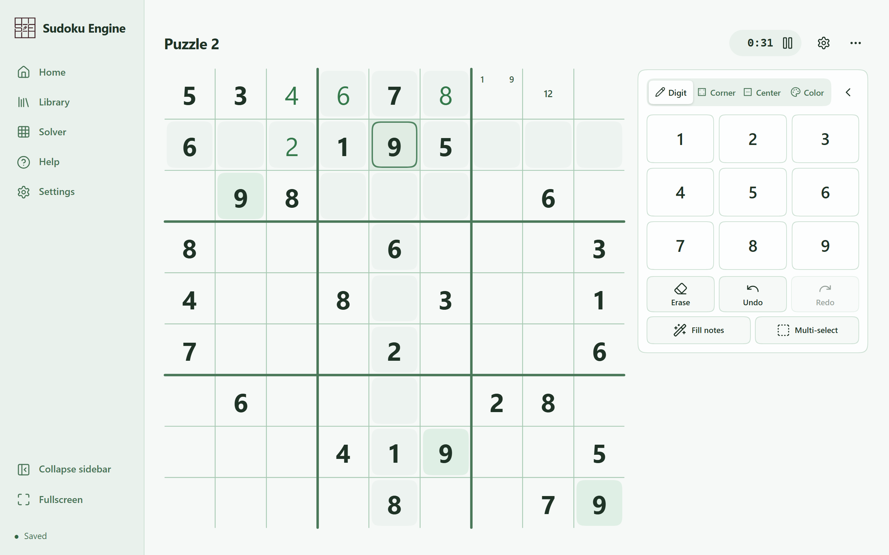
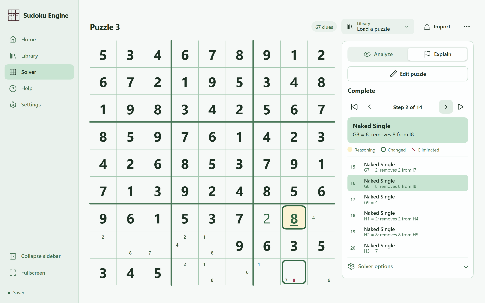

# Sudoku Engine

A browser-only classic Sudoku platform: create, play and solve puzzles, with a human-technique solver that explains every deduction.

[](https://www.typescriptlang.org/)
[](https://vite.dev/)
[](https://vitest.dev/)
[](https://playwright.dev/)
[](LICENSE)

## Try it

**https://my-sudoku-engine.vercel.app**

Everything runs in your browser. There is no account, no server and no tracking; your library lives in your browser's IndexedDB.

| Play | Explain |
| --- | --- |
|  |  |

## Features

**Play**

- Board-first screen with a timer that counts only active play: pausing covers the board, and hidden tabs or unfocused windows are never counted.
- Corner and center notes in the SudokuPad convention, six cell colors with optional patterns for color-blind players, and multi-cell selection with a configurable hotkey.
- Fill notes writes candidates from row, column and box constraints only; it never consults the solution.
- Every edit is undoable, including pasted cells. Copy and paste carry digit, notes and color, never clue status.
- Mark correct digits uses the unique solution found by the exact search in a worker, and is unavailable for puzzles that do not have one.

**Create and import**

- Drafts autosave on every edit, conflicts included. Finish locks the clues; boards with fewer than 17 clues ask for confirmation.
- Import from an 81-character string, a decorated 9-line grid, `.sdk`/`.ss`/`.sdm`/`.txt` collections or a JSON game export, with a live preview and precise error messages. Collections import as drafts in one step.

**Solver**

- 33 primary technique families plus five uniqueness-conditional ones, from singles and subsets through fish, wings, coloring, chains, ALS, forcing nets, Exocet, SK loops, Fireworks, Tridagon and templates.
- Discovery proposes a step; an independent checker accepts it. A separate exact search counts solutions, so "unique" is never inferred from the logical path, and a "Perfect" result never depends on uniqueness.
- Analyze shows the summary (solution count, technique statistics); Explain steps through each deduction with the reasoning cells, the changed cell and the eliminated candidates highlighted on the board.
- Runs in a Web Worker with cancellation and honest progress (phase, steps found, elapsed time; no invented percentage).
- The engine's time and work defaults have not been benchmark-calibrated yet, and the engine's Analyze mode and confined rollout stay off by default. See [docs/roadmap.md](docs/roadmap.md).

**Library, settings and data**

- Personal library with drafts and puzzles, stored in IndexedDB; versioned JSON backups with whole-file validation and a preview before applying.
- Light and dark modes, each with five pastel palettes; accessibility options for text and digit size, color-blind palette, stronger digits, high contrast and reduced motion.
- Configurable keyboard shortcuts, a collapsible sidebar and application-wide fullscreen.

## Run locally

Verified with Node.js 24.19 and npm 11.17.

```bash
cd web && npm ci && npm run dev
```

Open http://localhost:5173. The port is fixed (`strictPort`); Vite reports an error if it is taken.

Data belongs to the browser, profile and origin you use: another browser, `127.0.0.1` instead of `localhost`, or a different port has a separate library. Use **Settings → Export backup** to move it.

## Development

All scripts run from `web/`. Browser tests need Chromium once:

```bash
npx playwright install chromium
```

| Script | What it does |
| --- | --- |
| `npm run dev` | Vite dev server at http://localhost:5173 |
| `npm run typecheck` | `tsc --noEmit` for the app and for the worker project |
| `npm test` | Vitest unit, solver and storage suites (run serially; the solver fixtures are CPU-bound) |
| `npm run build` | Production build into `web/dist/` |
| `npm run test:e2e` | Playwright suites against the dev server on http://127.0.0.1:5174, isolated profiles |
| `npm run test:e2e:production` | Playwright smoke suite against the built app served on http://127.0.0.1:5175 |
| `npm run bench:solver` | Solver benchmark schema check and production-browser dry run on port 5175 |

Browser tests use their own origins and temporary profiles, so they never touch the personal library at `localhost:5173`. Screenshots and traces land in `web/test-results/`, which is ignored by Git.

## Architecture

Zero runtime dependencies: plain TypeScript, no UI framework, native IndexedDB, Vite for building. Squircle shapes use native CSS `corner-shape` and fall back to rounded corners.

| Directory | Responsibility |
| --- | --- |
| `web/src/domain` | Rules, cell model, puzzle formats and import parsers, editor and library state, settings, backup schema and validation |
| `web/src/storage` | IndexedDB adapter behind a repository interface; the whole library saves in one atomic transaction |
| `web/src/app` | Controller, hash router, solver controller and the worker bridge |
| `web/src/ui` | Screens and vanilla components (select, menu, segmented switch, switch) modelled on HeroUI's anatomy |
| `web/src/solver` | The engine: `rules`, `state`, `proof`, `techniques`, `scheduling`, `transport`, plus exact search and human-path orchestration |
| `web/src/workers` | Worker entry points |

The solver separates finding a step from believing it. Technique discovery proposes effects with their premises; an independent checker reconstructs the inference and only then commits it to the candidate state, so no detector can mint an accepted step. The exact solver starts from the original clues and rules, never from the human-pruned candidates, which is what makes its solution count independent evidence. Uniqueness-based techniques run on a separate, clearly labelled path: a "Perfect" result is one whose proof used none of them.

## Documentation

- [docs/README.md](docs/README.md) — index of everything below, plus the historical records.
- [docs/roadmap.md](docs/roadmap.md) — delivery sequence and what is still open.
- [docs/decisions.md](docs/decisions.md) — the decision log, D001 onward.
- [docs/solver/architecture.md](docs/solver/architecture.md) — engine architecture and coding guide, with one document per technique family under `docs/solver/techniques/`.

## Status and roadmap

M1 (creation, play, library, settings, backups) and M2 (the solver) are delivered and merged. Next on the [roadmap](docs/roadmap.md): M3, a classic construction assistant; M4 and M5, variant rules (diagonal, killer, thermometer) and their solver support; M6, gameplay hints.

Limits worth knowing: only desktop Chromium is verified, and there is no sync between devices; backups are the transfer mechanism.

## Author

Maria Clara Oliveira Santos — [@slaywithoutd](https://github.com/slaywithoutd)

## License

[MIT](LICENSE).
